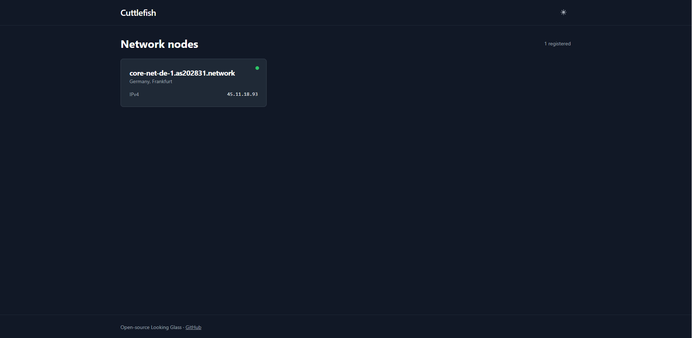
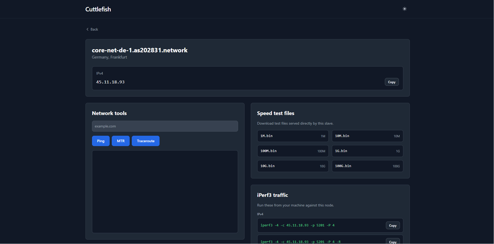

# Cuttlefish Looking Glass

An open-source **Looking Glass** with a **master/slave** architecture, written in Go. The master provides a web UI for selecting a slave, viewing its IPv4/IPv6 addresses, running network tools (`ping`, `mtr`, `traceroute`, `iperf3`), and downloading test files.

## Features

- Web UI in the style of shadcn (Tailwind CSS).
- Master and Slave written in Go, packaged in separate Docker images.
- Streaming command output via Server-Sent Events.
- Test files: 1M, 10M, 100M, 1G, 10G, 100G.
- Ready-to-use images built via GitHub Actions and published to GHCR.

## Demo

A live Looking Glass demo is available as the ApexNodes hosting page: https://cuttlefish.apexnodes.xyz/

### Screenshots





## Quick install with the interactive installer

The easiest way to deploy Cuttlefish is using the bash installer. It installs Docker, generates tokens, optionally sets up Nginx with SSL, and configures the master or slave for you.

```bash
# Clone the repo and run the installer
git clone https://github.com/trusted-technologies/cuttlefish.git
cd cuttlefish/scripts
sudo bash install.sh
```

Or download just the installer:

```bash
curl -sSL https://raw.githubusercontent.com/trusted-technologies/cuttlefish/main/scripts/install.sh | sudo bash
```

### What the installer does

- Installs Docker if it is not already present.
- For a **master**: generates a `MASTER_TOKEN`, starts the master container, and optionally installs Nginx with Let's Encrypt or self-signed SSL.
- For a **slave**: asks for the master URL and token, detects the public IP, starts the slave container with `iperf3`, and lets you choose which test file sizes to keep.

### Helper scripts

After installation, use the helper scripts in `/opt/cuttlefish` (or `scripts/`):

```bash
sudo bash scripts/update.sh      # pull latest images and recreate containers
sudo bash scripts/reinstall.sh   # reconfigure and reinstall
sudo bash scripts/uninstall.sh   # remove containers, volumes and config
```

You can also run the installer with a subcommand directly:

```bash
sudo bash install.sh master      # install master
sudo bash install.sh slave       # install slave
sudo bash install.sh update      # update
sudo bash install.sh reinstall   # reconfigure
sudo bash install.sh uninstall   # uninstall
```

## Architecture

- **Master** — web server and slave registry.
- **Slave** — agent that registers with the master and executes network commands.
- Communication between master and slave uses HTTP/REST.

## Requirements

- Docker Engine 24+ or Docker Desktop 4+
- Docker Compose 2+ (for the compose-based setup)
- (Optional) Go 1.24+ for building binaries without Docker

## Quick start (Docker Compose)

```bash
git clone https://github.com/trusted-technologies/cuttlefish.git
cd cuttlefish
export MASTER_TOKEN=$(openssl rand -hex 16)
docker compose up -d --build
```

Open http://localhost:8080. The local slave `local-slave` will appear in the UI.

## Deploying the master

### Windows (Docker Desktop / WSL)

1. Install [Docker Desktop](https://www.docker.com/products/docker-desktop/). If using WSL2, enable WSL integration in Docker Desktop settings.
2. Open PowerShell or a WSL terminal and run:

```powershell
$env:MASTER_TOKEN = "$(openssl rand -hex 16)"
docker run -d `
  --name cuttlefish-master `
  -p 8080:8080 `
  -e MASTER_ADDR=":8080" `
  -e MASTER_TOKEN="$env:MASTER_TOKEN" `
  ghcr.io/trusted-technologies/cuttlefish-master:main
```

Or using WSL/bash:

```bash
export MASTER_TOKEN=$(openssl rand -hex 16)
docker run -d \
  --name cuttlefish-master \
  -p 8080:8080 \
  -e MASTER_ADDR=":8080" \
  -e MASTER_TOKEN="$MASTER_TOKEN" \
  ghcr.io/trusted-technologies/cuttlefish-master:main
```

3. Open http://localhost:8080 in your browser.

### Linux

```bash
export MASTER_TOKEN=$(openssl rand -hex 16)
docker run -d \
  --name cuttlefish-master \
  --restart unless-stopped \
  -p 8080:8080 \
  -e MASTER_ADDR=":8080" \
  -e MASTER_TOKEN="$MASTER_TOKEN" \
  ghcr.io/trusted-technologies/cuttlefish-master:main
```

Or with Docker Compose:

```yaml
services:
  master:
    image: ghcr.io/trusted-technologies/cuttlefish-master:main
    container_name: cuttlefish-master
    restart: unless-stopped
    ports:
      - "8080:8080"
    environment:
      MASTER_ADDR: ":8080"
      MASTER_TOKEN: "${MASTER_TOKEN}"
```

```bash
export MASTER_TOKEN=$(openssl rand -hex 16)
docker compose up -d
```

## Deploying a slave on Linux

The slave must be reachable from the master (public IP or internal address in the same network).

```bash
export MASTER_TOKEN="<same token as the master>"
export MASTER_URL="http://<master-ip>:8080"
export SLAVE_PUBLIC_URL="http://<this-slave-ip>:8080"
export SLAVE_IPV4="<this-slave-public-ipv4>"

# Optional: set a public IPv6 if the node has one.
# export SLAVE_IPV6="<this-slave-public-ipv6>"

docker run -d \
  --name cuttlefish-slave \
  --restart unless-stopped \
  -p 8080:8080 \
  -p 5201:5201 \
  --cap-add NET_RAW \
  -e SLAVE_ID="ams-01" \
  -e SLAVE_NAME="Amsterdam 01" \
  -e SLAVE_PUBLIC_URL="$SLAVE_PUBLIC_URL" \
  -e SLAVE_IPV4="$SLAVE_IPV4" \
  -e SLAVE_IPV6="$SLAVE_IPV6" \
  -e MASTER_URL="$MASTER_URL" \
  -e SLAVE_TOKEN="$MASTER_TOKEN" \
  -e SLAVE_LOCATION="Amsterdam, NL" \
  -e SLAVE_ADDR=":8080" \
  -e IPERF_PORT="5201" \
  -e FILES_DIR="/data/files" \
  ghcr.io/trusted-technologies/cuttlefish-slave:main
```

> **Important:** `SLAVE_PUBLIC_URL` is the address the master uses to reach the slave. If the master and slave are on the same Docker network, you can use the container name, e.g. `http://slave:8080`.
>
> The slave auto-detects its IP addresses, but inside Docker it usually sees the container IP (e.g. `172.17.0.2`). Set `SLAVE_IPV4`/`SLAVE_IPV6` to show the real public addresses in the UI.

### Limiting test file sizes

By default the slave creates `1M`, `10M`, `100M`, `1G`, `10G` and `100G` test files. To skip the larger ones, set `FILES_SIZES`:

```bash
-e FILES_SIZES="1M,10M,100M,1G"
```

Only the listed sizes are created on disk and shown in the UI.

### Docker Compose for the slave

```yaml
services:
  slave:
    image: ghcr.io/trusted-technologies/cuttlefish-slave:main
    container_name: cuttlefish-slave
    restart: unless-stopped
    ports:
      - "8080:8080"
      - "5201:5201"
    cap_add:
      - NET_RAW
    environment:
      SLAVE_ID: "ams-01"
      SLAVE_NAME: "Amsterdam 01"
      SLAVE_PUBLIC_URL: "http://<this-slave-ip>:8080"
      SLAVE_IPV4: "<this-slave-public-ipv4>"
      SLAVE_IPV6: "<this-slave-public-ipv6>"
      MASTER_URL: "http://<master-ip>:8080"
      SLAVE_TOKEN: "${MASTER_TOKEN}"
      SLAVE_LOCATION: "Amsterdam, NL"
      SLAVE_ADDR: ":8080"
      IPERF_PORT: "5201"
      FILES_DIR: "/data/files"
```

```bash
export MASTER_TOKEN="<master token>"
docker compose up -d
```

## Environment variables

### Master

| Variable      | Description                  | Default  |
|---------------|------------------------------|----------|
| `MASTER_ADDR` | Listen address               | `:8080`  |
| `MASTER_TOKEN`| Token required from slaves   | `''`     |

### Slave

| Variable           | Description                                 | Default       |
|--------------------|---------------------------------------------|---------------|
| `SLAVE_ID`         | Unique slave identifier                     | hostname      |
| `SLAVE_NAME`       | Human-readable name                         | `SLAVE_ID`    |
| `SLAVE_PUBLIC_URL` | URL the master uses to reach this slave     | —             |
| `SLAVE_IPV4`       | Public IPv4 to show in the UI               | auto-detected |
| `SLAVE_IPV6`       | Public IPv6 to show in the UI               | auto-detected |
| `MASTER_URL`       | Master URL for registration                 | —             |
| `SLAVE_TOKEN`      | Same token as `MASTER_TOKEN`                | —             |
| `SLAVE_LOCATION`   | Location label                              | —             |
| `SLAVE_ADDR`       | Listen address                              | `:8080`       |
| `IPERF_PORT`       | iperf3 server port                          | `5201`        |
| `FILES_DIR`        | Directory for test files                    | `/data/files` |
| `FILES_SIZES`      | Comma-separated test file sizes to serve    | `1M,10M,...`  |

## Building from source

```bash
go build -o bin/master ./cmd/master
go build -o bin/slave ./cmd/slave
```

Run:

```bash
./bin/master -addr :8080 -token secret
./bin/slave -master-url http://localhost:8080 -public-url http://localhost:8081 -token secret -addr :8081
```

## License

MIT — see [LICENSE](LICENSE).
